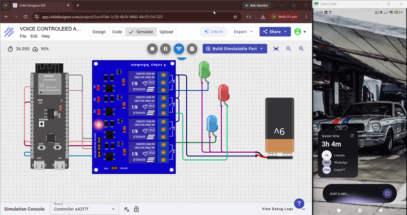

# Voice-Controlled Home Automation System Using ESP32 and Google Assistant

## Overview

This project implements a Voice-Controlled Home Automation System using ESP32, Google Assistant, and Sinric Pro. The system enables users to control connected devices using voice commands through Google Assistant. Commands are transmitted through Sinric Pro Cloud and executed by the ESP32 over a Wi-Fi network.

Three LEDs (Red, Green, and Blue) are used to represent smart appliances and demonstrate the functionality of the system.

---

## Objectives

* Develop a voice-controlled automation system.
* Integrate ESP32 with Google Assistant.
* Implement cloud-based communication using Sinric Pro.
* Control multiple devices through voice commands.
* Demonstrate IoT-based smart home automation.

---

## Components Used

* ESP32 Development Board
* Red LED
* Green LED
* Blue LED
* Breadboard
* Jumper Wires
* Wi-Fi Network
* Google Assistant
* Sinric Pro Platform
* Arduino IDE

---

## System Architecture

User Voice Command
->
Google Assistant
->
Sinric Pro Cloud
->
Wi-Fi Network
->
ESP32
->
Red LED / Green LED / Blue LED

---

## Circuit Diagram

Circuit diagram is available in the `Circuit_Diagram` folder.

---

## Pin Configuration

| Device    | GPIO Pin |
| --------- | -------- |
| Red LED   | GPIO4    |
| Green LED | GPIO15   |
| Blue LED  | GPIO2    |

---

## Working Principle

1. ESP32 connects to the Wi-Fi network.
2. Sinric Pro authenticates the ESP32 device.
3. Google Assistant receives a voice command.
4. The command is sent to Sinric Pro Cloud.
5. Sinric Pro forwards the command to ESP32.
6. ESP32 updates the corresponding GPIO pin.
7. The selected LED turns ON or OFF.

---

## Features

* Voice-controlled operation
* Google Assistant integration
* Cloud-based communication
* Real-time device control
* Wireless operation using Wi-Fi
* Low-cost IoT implementation
* Scalable architecture

---

## Results

The system successfully established communication between Google Assistant, Sinric Pro Cloud, and ESP32. Voice commands were accurately processed and executed in real time. The Red, Green, and Blue LEDs responded correctly to user commands, demonstrating reliable operation and low response latency.

---

## Project Demonstration Video

https://drive.google.com/file/d/1QVRz4gogtG4Z4sCtLEmQrsCyxuU_RzDf/view?usp=drive_link

---

## Repository Structure

Arduino_Code/ – ESP32 source code

Circuit_Diagram/ – Circuit diagram files

Images/ – Project screenshots and photographs

Report/ – Project report and documentation

README.md – Project overview

---

## Applications

* Smart Home Automation
* Smart Lighting Systems
* Voice-Controlled Appliances
* Office Automation
* Assistive Technologies
* IoT-Based Device Control

---

## Future Scope

* Relay-based appliance control
* Mobile application integration
* Energy monitoring
* AI-based automation
* Cloud analytics
* Smart scheduling systems

---

## Author

Anil Kumar Senapati

B.Tech Electronics and Telecommunication Engineering (ETC)

